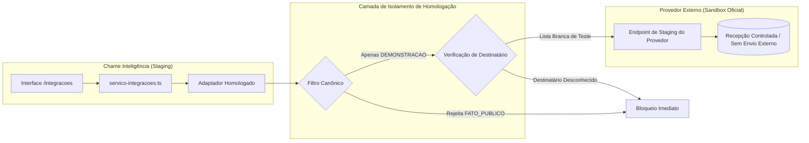

# Especificação Técnica do Gate 10 — Homologação de Provedores Externos

> **Status:** DOCUMENTO DE ESPECIFICAÇÃO TÉCNICA E GOVERNANÇA PREPARATÓRIA  
> **Fase:** PLANEJAMENTO TÉCNICO (Sem contratações, sem tráfego externo ativo e sem credenciais reais)  
> **Data de Referência:** 07 de setembro de 2026  
> **Repositório:** `chame-inteligencia`

---

## 1. Objetivo e Contexto Estratégico

O **Gate 9** estabeleceu com sucesso a arquitetura determinística e desacoplada de integrações externas, operando exclusivamente com simuladores locais (*sandboxes* em memória) para quatro canais comerciais B2B: **CRM**, **E-mail**, **WhatsApp** e **Discador/Telefonia**.

Este documento define os **critérios técnicos, normativos, de segurança da informação e de governança humana** indispensáveis para a futura execução do **Gate 10 — Homologação de Provedores Externos**.

### 1.1. Limite Operacional Desta Fase
- **Nenhum serviço externo foi contratado ou ativado.**
- **Nenhuma chave de API ou credencial real foi adicionada ao sistema.**
- **Nenhum dado, mensagem ou chamada é transmitida.**
- O sistema permanece integralmente no ambiente controlado `SIMULACAO`.

---

## 2. Princípios Canônicos e Conformidade LGPD

Qualquer homologação com provedores externos terceirizados deverá obedecer estritamente aos princípios de privacidade e proteção de dados definidos em `AGENTS.md` e na Lei Geral de Proteção de Dados (LGPD — Lei nº 13.709/2018):

```
+-----------------------------------------------------------------------------+
|                      PRINCÍPIOS DA HOMOLOGAÇÃO GATE 10                      |
+-----------------------------------------------------------------------------+
| 1. MINIMIZAÇÃO       | Apenas contatos profissionais B2B estritamente       |
|                      | necessários à comunicação corporativa institucional. |
+----------------------+------------------------------------------------------+
| 2. DADOS PROIBIDOS   | CPF, dados de saúde, residenciais, bancários e       |
|                      | pessoais permanecem terminantemente proibidos.       |
+----------------------+------------------------------------------------------+
| 3. ISOLAMENTO TOTAL  | Homologações utilizam exclusivamente registros       |
|                      | DEMONSTRACAO (fictícios). Registros reais bloqueados.|
+----------------------+------------------------------------------------------+
| 4. INTERVENÇÃO       | Nenhuma mensagem é disparada sem prévia sanitizada,  |
|    HUMANA            | justificativa formal e dupla aprovação de operador.  |
+----------------------+------------------------------------------------------+
| 5. DIREITO DE OPOSIÇÃO| Mecanismo de desativação imediata (opt-out) ativo em |
|                      | todos os canais de contato corporativo.              |
+-----------------------------------------------------------------------------+
```

---

## 3. Critérios de Avaliação e Seleção de Provedores

A escolha de parceiros tecnológicos para homologação no Gate 10 deverá atender aos seguintes requisitos por categoria de conector:

### 3.1. CRM Comercial B2B
- **Isolamento de Dados:** Arquitetura *multi-tenant* com isolamento lógico estrito ou instância dedicada em território brasileiro ou país com nível adequado de proteção de dados.
- **Autenticação:** Suporte a OAuth 2.0 com *refresh tokens* ou API Keys com escopo restrito de leitura e gravação em ambiente de *staging*.
- **Ambiente de Teste:** Disponibilização de *Sandbox* ou *Developer Account* isolada da base de produção do cliente.
- **Auditoria de Eventos:** Suporte a Webhooks com assinatura criptográfica HMAC (SHA-256) para confirmação de recebimento de leads/oportunidades.
- **Criptografia:** TLS 1.3 em trânsito e criptografia AES-256 para dados em repouso.

### 3.2. Provedor de E-mail Corporativo B2B
- **Segurança de Domínio:** Suporte obrigatório a registros DNS institucionais: SPF (*Sender Policy Framework*), DKIM (*DomainKeys Identified Mail*) e DMARC (*Domain-based Message Authentication, Reporting and Conformance*).
- **Ambiente Sandbox Dedicado:** Roteamento restrito com *Mail Trap* ou domínio sintético (ex: `@sandbox.chame.com.br`), garantindo que nenhum e-mail seja entregue a caixas de entrada externas durante a homologação.
- **Gestão de Reputação:** Tratamento automático de eventos de *Bounce* (devolução) e *Spam Complaint* com enriquecimento imediato na tabela `EventoIntegracao`.
- **Restrição de Provedor Pessoal:** Bloqueio rígido no adaptador para provedores pessoais gratuitos (`@gmail.com`, `@hotmail.com`, `@yahoo.com`, etc.).

### 3.3. Provedor Oficial de WhatsApp Business
- **Canal Oficial:** Homologação restrita a Provedores de Solução de Negócios (BSPs — *Business Solution Providers*) oficiais ou WhatsApp Cloud API direta da Meta.
- **Número Corporativo Dedicado:** Utilização exclusiva de número telefônico institucional de teste cadastrado no *Meta Business Manager* da Chame Táxi.
- **Modelos de Mensagem (Templates):** Utilização estrita de *Message Templates* categorizados como "Utilidade" ou "Marketing B2B", pré-aprovados pela Meta, contendo opção clara de encerramento da conversa.
- **Opt-in e Opt-out Automáticos:** O conector deve processar respostas do destinatário com comandos de desativação (`SAIR`, `PARAR`, `CANCELAR`) e registrar automaticamente no banco a desativação do contato.
- **Isolamento em Homologação:** Mensagens de teste restritas a números internos autorizados da equipe de homologação.

### 3.4. Telefonia e Central de Atendimento B2B (Discador)
- **Protocolo Seguro:** Conexão via SIP Trunking com criptografia TLS para sinalização e SRTP (*Secure Real-Time Transport Protocol*) para áudio.
- **Operação de SDR Humano:** O sistema **não implementará robocall** nem discadores preditivos de chamadas em massa. A integração servirá exclusivamente para enriquecer a tela do operador humano (SDR) e registrar início/fim de chamadas institucionais de sondagem.
- **Gravação e Consentimento:** Quando houver gravação da chamada para controle de qualidade, aviso sonoro obrigatório no início da ligação conforme regulamentação da Anatel e LGPD.
- **Número de Teste:** Homologação realizada apenas com ramais internos de PBX de laboratório.

---

## 4. Requisitos de Ambiente de Homologação (Staging/Sandbox)



### 4.1. Regras de Isolamento de Dados em Homologação
1. **Dados Permitidos:** Durante todo o Gate 10, apenas as **5 instituições de demonstração** e os **14 contatos fictícios de demonstração** cadastrados no banco podem ser submetidos à homologação.
2. **Dados Reais Bloqueados:** Os 109 contatos profissionais públicos reais (`FATO_PUBLICO`) e as 8.212 instituições reais (`FATO_OFICIAL`) permanecem 100% bloqueados para qualquer conector com tráfego de rede ativo.
3. **Lista Branca de Destinatários:** Para testes de e-mail e telefonia, apenas caixas postais e ramais explicitamente listados em variável de configuração de homologação (`HOMOLOGACAO_WHITELIST_DESTINATARIOS`) são autorizados.

---

## 5. Gestão Segura de Credenciais e Infraestrutura

### 5.1. Regras Inegociáveis de Armazenamento
- **Proibição Absoluta de Credenciais no Git:** Nenhuma chave de API, segredo de webhook, senha de banco de dados ou certificado TLS poderá ser commitado no repositório. Arquivos `.env`, `.env.local` e `.env.production` estão permanentemente ignorados pelo `.gitignore`.
- **Gerenciador de Segredos:** Em ambiente de staging/produção, as credenciais deverão ser injetadas por variáveis de ambiente gerenciadas por serviço de cofre seguro (ex: Google Cloud Secret Manager, AWS Secrets Manager ou Azure Key Vault).
- **Menor Privilégio:** Chaves de teste geradas nos provedores devem ter permissão estrita de execução em sandbox, sem acesso a dados cadastrais de cobrança, faturamento ou bases de clientes reais do provedor.
- **Ciclo de Vida e Rotação:** Rotação de chaves a cada 90 dias ou imediatamente após qualquer suspeita de exposição.

---

## 6. Governança Operacional e Alçada de Aprovação

Toda operação no Gate 10 manterá o fluxo de dupla intervenção humana validado no Gate 8 e Gate 9:

```
+-----------------------------------------------------------------------------------+
|                        FLUXO DE HOMOLOGAÇÃO COM DUPLA ALÇADA                       |
+-----------------------------------------------------------------------------------+
| 1. PREPARAÇÃO        | Operador seleciona conector em HOMOLOGACAO, conta demo e   |
|                      | contato demo. Define os parâmetros técnicos de teste.     |
+----------------------+------------------------------------------------------------+
| 2. PRÉVIA SANITIZADA | Sistema valida se há CPF, credenciais ou e-mail pessoal.  |
|                      | Apresenta o payload formatado na interface com aviso claro.|
+----------------------+------------------------------------------------------------+
| 3. APROVAÇÃO FORMAL  | Operador deve marcar a caixa de confirmação humana e      |
|                      | justificar formalmente o teste técnico de homologação.     |
+----------------------+------------------------------------------------------------+
| 4. EXECUÇÃO STAGING  | Chamada enviada ao endpoint de sandbox do parceiro via     |
|                      | canal seguro (HTTPS TLS 1.3) com timeout de 3.000 ms.     |
+----------------------+------------------------------------------------------------+
| 5. REGISTRO IMUTÁVEL | Resposta da API parceira (código HTTP, latência e ID) é    |
|                      | persistida no banco local em EventoIntegracao.             |
+-----------------------------------------------------------------------------------+
```

---

## 7. Engenharia de Resiliência: Rate Limiting, Circuit Breaker e Rollback

### 7.1. Limites de Taxa (*Rate Limiting*)
Para evitar consumo indevido de cotas de teste e sobrecarga de endpoints, o sistema de homologação implementará limitadores rígidos:
- **Máximo de requisições por conector:** 5 requisições por minuto.
- **Máximo diário por operador:** 50 requisições de teste por dia.
- **Máximo de lote de teste:** 5 itens simultâneos.

### 7.2. Mecanismo de Disjuntor (*Circuit Breaker*)
- **Limiar de Falhas:** Se um conector apresentar 3 erros consecutivos (códigos HTTP 5xx) ou 3 timeouts sucessivos (> 3.000 ms), o conector entra automaticamente no estado `ERRO_CONFIGURACAO`.
- **Duração do Bloqueio:** O circuito permanece aberto por 5 minutos, bloqueando qualquer nova requisição e registrando evento de proteção no banco de dados.
- **Fallback Transparente:** Durante o período de circuito aberto, as solicitações podem ser desviadas para o simulador local sem quebrar o fluxo do operador.

### 7.3. Botão de Pânico (*Kill-Switch*) e Procedimento de Rollback
O sistema contará com uma variável de ambiente mestra:
```bash
INTEGRACOES_KILL_SWITCH=true
```
Quando ativada, qualquer chamada de rede para provedores externos é abortada antes do disparo, e o sistema reverte instantaneamente todos os adaptadores para o modo `SIMULACAO` local, garantindo zero impacto operacional e zero vazamento de dados.

---

## 8. Política de Logs e Retenção

1. **Sanitização de Payloads:** Os campos gravados em `EventoIntegracao.payloadResumo` e `resultadoResumo` passam por função de higienização automática:
   - Tokens Bearer, senhas e headers `Authorization` são substituídos por `[REDACTED]`.
   - Números de telefone têm os dígitos centrais ofuscados (`(11) 98***-**12`).
   - E-mails têm o nome de usuário parcialmente mascarado (`m***a@empresa.com.br`).
2. **Tempo de Retenção:** Os registros de eventos de integração devem ser mantidos por **90 dias** para fins de auditoria de governança, sendo automaticamente arquivados ou expurgados após esse prazo.

---

## 9. Critérios de Sucesso para Aprovação do Gate 10

Para que um conector passe da fase de especificação para homologado no Gate 10, os seguintes critérios objetivos devem ser comprovados:

| ID | Critério de Homologação | Indicador de Conformidade |
| :--- | :--- | :--- |
| **C1** | Autenticação Segura | Provedor autenticado com sucesso em endpoint de staging sem expor credenciais em logs ou código. |
| **C2** | Latência e Timeout | 100% das requisições respondidas em menos de 3.000 ms em condições normais de rede. |
| **C3** | Tratamento de Erros | Resposta apropriada e registro de `FALHA_SIMULADA` ou `ERRO` diante de payloads inválidos ou falhas intencionais. |
| **C4** | Isolamento Canônico | Nenhuma requisição enviada com dados reais `FATO_OFICIAL` ou contatos `FATO_PUBLICO`. |
| **C5** | Rastreabilidade Completa | Todo evento de staging possui registro correspondente em `EventoIntegracao` com ID de transação retornado pelo provedor. |
| **C6** | Teste de Desativação (Opt-out) | Comprovação de que o conector suspende novas tentativas caso o contato seja desativado ou rejeitado no Gate 7. |
| **C7** | Teste de Rollback | Funcionamento comprovado do *Kill-Switch*, revertendo imediatamente para simulação local em menos de 1 segundo. |

---

## 10. Conclusão e Próximos Passos

O presente documento consolida todos os parâmetros operacionais, requisitos de conformidade e salvaguardas técnicas exigidas para a homologação futura de parceiros externos.

Com a conclusão do Gate 9 em simulação plena e este diagnóstico de engenharia para o Gate 10, o projeto **Chame Inteligência** atinge maturidade técnica e regulatória exemplar, garantindo segurança de dados, rastreabilidade institucional e soberania sobre seus canais comerciais.
