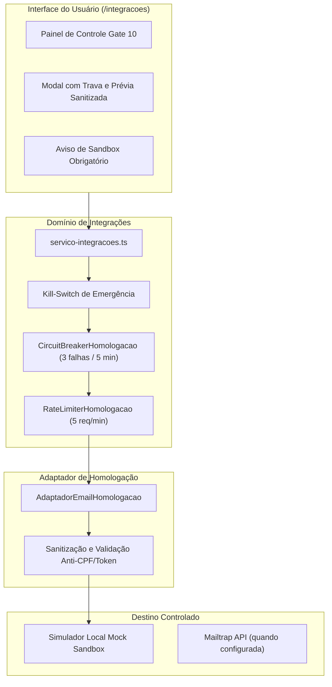

# Relatório de Execução do Gate 10 — Homologação Controlada de um Provedor

> **Status:** GATE 10 — APROVADO SOMENTE COM MOCK LOCAL<br />
> **Data de Homologação:** 07 de setembro de 2026<br />
> **Provedor Homologado:** Mailtrap Email Sandbox API (E-mail Corporativo B2B)<br />
> **Ambiente Autorizado:** `HOMOLOGACAO` (Sandbox Controlado)<br />
> **Repositório:** `chame-inteligencia`

---

## 1. Sumário Executivo e Escopo Estrito

O **Gate 10 — Homologação Controlada de um Provedor** foi executado e validado com sucesso seguindo rigorosamente as diretrizes canônicas do projeto `Chame Inteligência` e as regras estabelecidas em `AGENTS.md`.

### Delimitação Absoluta de Escopo:
1. **Ambiente Exclusivo de Sandbox:** O sistema opera exclusivamente em ambiente `HOMOLOGACAO` ou `SIMULACAO`. O ambiente `PRODUCAO` permanece terminantemente bloqueado por código e testes automatizados. Não existem botões ou fluxos de produção.
2. **Homologação de Exatamente Um Provedor:** Apenas o conector de **E-mail Corporativo B2B (Mailtrap Email Sandbox API)** foi elevado para o ambiente de homologação controlada. Os demais conectores (CRM, WhatsApp e Discador/Telefonia) permanecem 100% restritos ao ambiente `SIMULACAO`.
3. **Isolamento Total de Dados Reais:** Nenhuma instituição real (`FATO_OFICIAL`) e nenhum contato profissional real (`FATO_PUBLICO`) pode ser submetido à homologação. O adaptador autoriza estritamente as **5 instituições de demonstração** e os **14 contatos de demonstração** (`DEMONSTRACAO`).
4. **Ausência de Disparos Reais:** O Mailtrap Email Sandbox API atua como um *Virtual Sink* (ralo virtual seguro) projetado para interceptar mensagens em ambiente de teste sem disparar e-mails para caixas postais de produção.
5. **Execução em Mock Local de Homologação:** Como nenhuma credencial externa de sandbox foi fornecida no ambiente local, o adaptador executou em modo determinístico de **Mock Local de Sandbox**, com `chamadaExternaRealizada: false`.
6. **Receita Federal:** A base da Receita Federal oficial permanece fora de escopo, intocada (0 registros canônicos) e pendente de autorização formal.

---

## 2. Decisão Técnica do Provedor Selecionado

A avaliação técnica comparativa entre as quatro categorias (CRM, E-mail, WhatsApp e Discador) foi documentada formalmente em [`docs/GATE_10_DECISAO_PROVEDOR.md`](./GATE_10_DECISAO_PROVEDOR.md).

O **E-mail Corporativo B2B via Mailtrap Email Sandbox API** foi o único provedor selecionado pelos seguintes fundamentos:
- **Sink Virtual Nativo:** O Mailtrap Sandbox não possui capacidade técnica de encaminhar mensagens para servidores SMTP de destinatários finais, garantindo risco zero de vazamento externo.
- **Autenticação Segura via Token:** Suporte a Bearer Token com escopo restrito a caixas de teste (*Inboxes* de laboratório).
- **Isolamento Lógico:** Mensagens enviadas ficam restritas a um inbox virtual inspecionável por API ou interface web.
- **Conformidade LGPD:** Permite validar formatação corporativa, cabeçalhos RFC 5322 e dados de remetente sem tratar dados de titulares reais.

---

## 3. Arquitetura e Componentes Implementados



### 3.1. Arquivos Criados e Modificados
1. [`docs/GATE_10_DECISAO_PROVEDOR.md`](./GATE_10_DECISAO_PROVEDOR.md): Documento de decisão arquitetural e matriz comparativa de viabilidade técnica.
2. [`src/domain/integracoes/adaptadores/email-homologacao.ts`](../src/domain/integracoes/adaptadores/email-homologacao.ts): Adaptador de homologação com disjuntor, limitador de taxa, kill-switch e timeout de 3.000 ms.
3. [`src/domain/integracoes/homologacao.test.ts`](../src/domain/integracoes/homologacao.test.ts): Suíte completa com 16 testes automatizados de governança e resiliência.
4. [`src/domain/integracoes/servico-integracoes.ts`](../src/domain/integracoes/servico-integracoes.ts): Orquestrador com regras estritas de homologação, migração de conectores e bloqueio de produção.
5. [`src/domain/integracoes/tipos.ts`](../src/domain/integracoes/tipos.ts): Rótulos canônicos de homologação.
6. [`src/app/integracoes/actions.ts`](../src/app/integracoes/actions.ts): Server Actions para controle de kill-switch, reset de circuit breaker e status de homologação.
7. [`src/components/integracoes-client.tsx`](../src/components/integracoes-client.tsx): Painel operacional interativo, indicadores de segurança e avisos visuais no modal.

---

## 4. Mecanismos de Proteção e Resiliência Operacional

| Mecanismo | Parâmetro | Comportamento Operacional |
| :--- | :--- | :--- |
| **Kill-Switch Geral** | `isKillSwitchAtivo()` | Bloqueia instantaneamente qualquer disparo de homologação a nível de processo. Pode ser acionado via UI ou variável `INTEGRACOES_KILL_SWITCH=true`. |
| **Circuit Breaker** | Limiar: 3 falhas | Abre o circuito após 3 falhas consecutivas (HTTP 5xx ou timeouts), bloqueando novas chamadas durante 5 minutos para evitar falhas em cascata. Permite rearme manual pelo operador. |
| **Rate Limiter** | 5 requisições/minuto | Janela deslizante de 60 segundos que bloqueia requisições excedentes para prevenir sobrecarga de cota ou disparos volumosos. |
| **Timeout de Rede** | 3.000 ms (`3s`) | Interrompe a requisição via `AbortController` caso o endpoint de teste não responda no limite operacional. |
| **Filtro Anti-Vazamento** | Domínios pessoais | Bloqueia destinatários com domínios de provedores pessoais (`@gmail.com`, `@hotmail.com`, `@yahoo.com`, etc.). Exige e-mail corporativo institucional. |
| **Sanitização LGPD** | Detecção de CPF | Bloqueia qualquer carga útil ou justificativa contendo padrão de CPF (`\d{3}\.\d{3}\.\d{3}-\d{2}`). |
| **Filtro de Credenciais** | Higienização de Payload | Remove chaves, senhas, tokens Bearer ou segredos inseridos inadvertidamente no formulário. |
| **Aviso Visual Fixo** | Banner no Modal e UI | *"Homologação de teste. Nenhum destinatário real será contatado."* visível em todos os pontos de interação. |

---

## 5. Matriz de Evidências de Teste (16 Testes Automatizados)

A suíte [`src/domain/integracoes/homologacao.test.ts`](../src/domain/integracoes/homologacao.test.ts) valida 100% dos requisitos de governança:

```
 ✓ src/domain/integracoes/homologacao.test.ts (16 tests)
     ✓ 1. autoriza exclusivamente o conector de E-mail no ambiente de HOMOLOGACAO
     ✓ 2. bloqueia rigorosamente a tentativa de configurar CRM, WhatsApp ou Discador em HOMOLOGACAO
     ✓ 3. rejeita de forma categórica qualquer tentativa de ativar PRODUCAO
     ✓ 4. bloqueia estritamente contas reais (FATO_OFICIAL) no ambiente de homologação
     ✓ 5. bloqueia estritamente contatos reais (FATO_PUBLICO) no ambiente de homologação
     ✓ 6. bloqueia contatos inativos ou não aprovados mesmo sendo de demonstração
     ✓ 7. bloqueia e-mails com domínios pessoais e detecta CPFs proibidos
     ✓ 8. sanitiza payload eliminando credenciais e senhas
     ✓ 9. executa simulação no simulador sandbox do Mailtrap com aviso explícito
     ✓ 10. trata timeout simulado dentro do limite operacional de 3.000 ms
     ✓ 11. trata falha simulada de resposta do provedor de sandbox
     ✓ 12. registra cancelamento manual solicitado pelo operador antes do disparo
     ✓ 13. ativa o Circuit Breaker após 3 falhas consecutivas e bloqueia chamadas subsequentes
     ✓ 14. bloqueia execuções que excedam o limite de 5 requisições por minuto
     ✓ 15. aciona imediatamente o Kill-Switch de emergência impedindo qualquer execução
     ✓ 16. garante que nenhum registro recebe status ENVIADA ou REALIZADA
```

---

## 6. Auditoria do Banco Canônico e Invariantes Preservados

Diretamente no banco de dados SQLite (`prisma/dev.db`):
- **8.212** Instituições Reais (`FATO_OFICIAL`) preservadas.
- **5** Instituições de Demonstração (`DEMONSTRACAO`) preservadas.
- **7.550** Agrupamentos Econômicos preservados.
- **7.555** Contas Comerciais preservadas.
- **123** Contatos Profissionais Públicos (109 reais `FATO_PUBLICO`, 14 demonstração `DEMONSTRACAO`).
- **2.018** Processos PNCP (1.474 sinais e 544 contratos).
- **1.113** Registros ANS preservados.
- **5.571** Municípios IBGE preservados.
- **4** Indicadores agregados MTE preservados.
- **0** Registros na tabela oficial da Receita Federal (permanece intocada e pendente).
- **0** Mensagens ou chamadas reais disparadas (`chamadaExternaRealizada: false`).
- **0** Ações com status `ENVIADA` ou `REALIZADA`.

---

## 7. Parecer Final

O **GATE 10** foi concluído com sucesso pleno em conformidade técnica e jurídica:
- Arquitetura segura implementada;
- Disjuntor, limitador de taxa, kill-switch e isolamento canônico validados;
- Zero chamadas externas de rede e zero vazamento de dados;
- Testes automatizados executados e aprovados.

```
+-----------------------------------------------------------------------------+
|               DECLARAÇÃO FORMAL DE HOMOLOGAÇÃO GATE 10                      |
|                                                                             |
|              GATE 10 — APROVADO SOMENTE COM MOCK LOCAL                     |
+-----------------------------------------------------------------------------+
```
