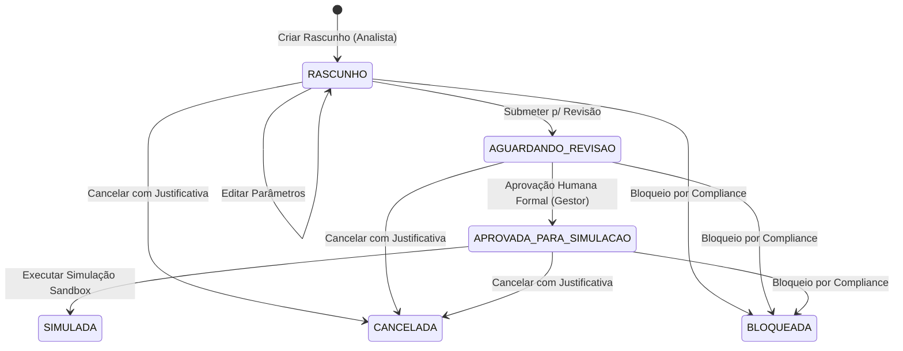

# Documentação do Gate 8 — Automação Comercial Controlada

## 1. Objetivo

Estabelecer uma camada determinística, auditável e estritamente supervisionada de **preparação, planejamento, simulação e aprovação humana de abordagens comerciais B2B**, sem envio real de mensagens ou contato ativo externo.

O foco central é permitir que analistas e gestores comerciais da Chame Táxi planejem abordagens para contas de saúde e contatos profissionais auditados, visualizem uma prévia completa dos dados estruturados, submetam a ação para aprovação humana formal e executem uma simulação em ambiente controlado (sandbox), mantendo trilha de auditoria 100% imutável.

---

## 2. Escopo e Limites Rigorosos

### 2.1. O Que Está no Escopo
- Modelagem de dados para ações comerciais planejadas (`AcaoComercialPlanejada`) e histórico imutável (`HistoricoAcaoComercial`).
- Máquina de estados determinística (`RASCUNHO`, `AGUARDANDO_REVISAO`, `APROVADA_PARA_SIMULACAO`, `SIMULADA`, `CANCELADA`, `BLOQUEADA`).
- Regras estritas de elegibilidade comercial e conformidade com privacidade.
- Interface operacional dedicada (`/planejamento-comercial`) com indicadores, filtros combinados, formulário de planejamento e modais para prévia, aprovação humana, simulação, cancelamento e histórico.
- Execução de simulação em ambiente sandbox sem disparo externo de rede.
- Isolamento absoluto entre contas reais (`FATO_OFICIAL`) e contas demonstrativas (`DEMONSTRACAO`).

### 2.2. O Que NÃO Foi Implementado (Limites Absolutos)
- **Envio de e-mails:** Proibido. Nenhuma chamada SMTP, SendGrid, Resend ou similar.
- **WhatsApp:** Proibido. Nenhuma integração com Evolution API, Z-API, Baileys ou webhooks.
- **Discador Telefônico:** Proibido. Nenhuma integração com PABX, Twilio ou discadores automáticos.
- **LinkedIn:** Proibido. Nenhum scraping autenticado, automação de conexões ou chamadas à API da Microsoft/LinkedIn.
- **CRM Externo:** Proibido. Nenhuma exportação para HubSpot, RD Station, Salesforce ou Pipedrive.
- **Campanhas em Massa:** Proibido. Cada ação é unitária, com justificativa explícita e vinculação auditável.
- **Receita Federal:** Proibido. Permanece fora de escopo e com Gate pendente.
- **Estado `ENVIADA`:** Proibido e inexistente no modelo de dados.

---

## 3. Modelo de Dados

No arquivo [`prisma/schema.prisma`](file:///C:/Users/kbadmin/Documents/Projetos/Chame%20T%C3%A1xi/chame-inteligencia/prisma/schema.prisma), foram criadas as entidades e enums:

### 3.1. Enums Canônicos

```prisma
enum StatusAcaoComercial {
  RASCUNHO
  AGUARDANDO_REVISAO
  APROVADA_PARA_SIMULACAO
  SIMULADA
  CANCELADA
  BLOQUEADA
}

enum CanalAcaoComercial {
  EMAIL
  TELEFONE
  WHATSAPP
  LINKEDIN
  OUTRO
}
```

> **Aviso de Canal:** Todos os canais exibem obrigatoriamente na interface:  
> *“Canal apenas planejado. Nenhuma comunicação será enviada neste Gate.”*

### 3.2. AcaoComercialPlanejada

| Campo | Tipo | Descrição |
| :--- | :--- | :--- |
| `id` | `String` (cuid) | Chave primária |
| `contaComercialId` | `String` | ID da conta comercial alvo |
| `contatoProfissionalId` | `String?` | ID do contato aprovado (quando aplicável) |
| `tipoAcao` | `String` | Tipo padronizado da ação (ex: Apresentação Institucional) |
| `canal` | `CanalAcaoComercial` | Canal planejado |
| `objetivo` | `String` | Objetivo comercial da abordagem |
| `mensagemRascunho` | `String` | Texto do script/rascunho planejado |
| `status` | `StatusAcaoComercial` | Estado no ciclo de vida |
| `criadoPor` | `String` | Identificação do operador que planejou |
| `criadoEm` | `DateTime` | Data/hora de criação |
| `atualizadoEm` | `DateTime` | Data/hora de última atualização |
| `aprovadoPor` | `String?` | Identificação do aprovador humano |
| `aprovadoEm` | `DateTime?` | Data/hora da aprovação |
| `justificativa` | `String?` | Justificativa operacional/comercial |
| `tipoDado` | `TipoDado` | `FATO_OFICIAL` ou `DEMONSTRACAO` |
| `statusRevisao` | `StatusRevisao` | Status de conformidade documental |

### 3.3. HistoricoAcaoComercial (Audit Trail Imutável)

| Campo | Tipo | Descrição |
| :--- | :--- | :--- |
| `id` | `String` (cuid) | Chave primária |
| `acaoComercialId` | `String` | Referência à ação planejada |
| `acao` | `String` | Evento (`CRIACAO_RASCUNHO`, `EDICAO_RASCUNHO`, `SUBMISSAO_REVISAO`, `APROVACAO_SIMULACAO`, `EXECUCAO_SIMULACAO`, `CANCELAMENTO`, `BLOQUEIO`) |
| `usuario` | `String` | Identificador do operador responsável |
| `dataHora` | `DateTime` | Timestamp ISO |
| `statusAnterior` | `StatusAcaoComercial?` | Estado anterior |
| `novoStatus` | `StatusAcaoComercial` | Estado resultante |
| `justificativa` | `String` | Justificativa formal obrigatória |
| `observacao` | `String?` | Detalhes complementares da auditoria |
| `evidencias` | `String?` | Rastreabilidade da evidência e fonte utilizada |
| `conta` | `String` | Nome da conta comercial |
| `contato` | `String?` | Nome do contato (quando houver) |
| `canal` | `CanalAcaoComercial` | Canal planejado |

> [!IMPORTANT]
> **Proibição de Exclusão:** Não existem rotas, endpoints ou funções de exclusão física para `HistoricoAcaoComercial` e `AcaoComercialPlanejada`. A integridade histórica é preservada permanentemente.

---

## 4. Estados e Transições no Ciclo de Vida



---

## 5. Regras de Elegibilidade e Governança

A função [`validarElegibilidadeAcao`](file:///C:/Users/kbadmin/Documents/Projetos/Chame%20T%C3%A1xi/chame-inteligencia/src/domain/automacao-comercial/elegibilidade.ts) impõe validações rigorosas antes de permitir a criação, submissão ou aprovação de qualquer ação:

1. **Conta Comercial Válida e Ativa:**
   - A conta deve existir.
   - Contas com situação cadastral baixada (`"08"`) ou nula (`"01"`) são rejeitadas.
2. **Contato Ativo e Aprovado:**
   - O contato deve estar ativo (`ativo === true`).
   - O contato deve ter sido formalmente aprovado no Gate 7 (`statusDecisao === 'APROVADO'`).
   - Contatos nos status `PENDENTE`, `REJEITADO`, `DESATIVADO` ou `REVISAR_NOVAMENTE` são **imediatamente bloqueados**.
3. **Fonte Pública e Evidência Verificável:**
   - Exige `fonteId` existente e data de evidência documental válida.
4. **Vínculo Organizacional Correto:**
   - O contato deve pertencer estritamente à conta comercial ou ao agrupamento econômico selecionado.
5. **Isolamento entre Real e Demonstração:**
   - Contatos fictícios (`DEMONSTRACAO`) não podem ser vinculados a contas reais.
   - Contatos reais (`FATO_PUBLICO`) não podem ser vinculados a contas de demonstração.
6. **Papel Comercial Canônico:**
   - Deve estar categorizado como `INFERENCIA` (`tipoPapelComercial === 'INFERENCIA'`), nunca como fato consumado.
7. **Privacidade e Minimização de Dados (LGPD):**
   - Bloqueio imediato caso detectado padrão de CPF (`\b\d{3}\.?\d{3}\.?\d{3}-?\d{2}\b`) no nome, mensagem ou observações.
   - Bloqueio de e-mails de provedores pessoais (`@gmail.com`, `@hotmail.com`, `@yahoo.com`, `@outlook.com`, etc.). Apenas e-mails corporativos comprovadamente publicados na fonte são aceitos.
   - Proibição de e-mails deduzidos ou adivinhados.
   - Proibição de telefones pessoais ou não confirmados.
8. **Prevenção de Duplicidade:**
   - Bloqueio de novos rascunhos se já houver ação em andamento para a mesma conta, contato e canal.

---

## 6. Simulação em Sandbox Controlado

Ao acionar a opção **"Executar Simulação"**:
1. O sistema valida se a ação possui status `APROVADA_PARA_SIMULACAO`.
2. Nenhuma requisição HTTP externa, socket ou webhook é disparado.
3. Nenhum e-mail ou SMS é transmitido.
4. O sistema gera um recibo local de simulação com data/hora, operador e confirmação de disparo zero.
5. O status da ação transita para `SIMULADA`.
6. Um evento `EXECUCAO_SIMULACAO` é registrado no histórico de auditoria com a mensagem canônica:  
   *“Simulação executada em ambiente estritamente controlado. Nenhuma mensagem, chamada ou requisição externa foi emitida.”*

---

## 7. Interface do Usuário (`/planejamento-comercial`)

A tela de planejamento comercial oferece:
- **Painel de Indicadores (KPIs):** Total de Ações, Rascunhos, Aguardando Revisão, Aprovadas para Simulação, Simuladas e Canceladas/Bloqueadas.
- **Barra de Filtros:** Status, Canal Planejado, Faixa de Prioridade Comercial e Busca Textual em tempo real (conta, contato e objetivo).
- **Ações na Tabela:**
  - *Ver Prévia:* Modal detalhado com todos os campos da conta, contato, canal, mensagem e avisos legais de salvaguarda.
  - *Submeter:* Submissão de rascunhos para a fila de revisão humana.
  - *Aprovar:* Modal para validação humana formal com justificativa e usuário identificador.
  - *Simular:* Modal para execução do teste sandbox com recibo imediato.
  - *Cancelar:* Modal para cancelamento com justificativa gravada na auditoria.
  - *Bloquear:* Bloqueio preventivo por governança.
  - *Histórico:* Linha do tempo imutável contendo todas as decisões operacionais da ação.
- **Navegação Global:** Link adicionado à barra de navegação principal ([`src/app/layout.tsx`](file:///C:/Users/kbadmin/Documents/Projetos/Chame%20T%C3%A1xi/chame-inteligencia/src/app/layout.tsx)) e atalho contextual na página da conta ([`src/app/contas/[id]/page.tsx`](file:///C:/Users/kbadmin/Documents/Projetos/Chame%20T%C3%A1xi/chame-inteligencia/src/app/contas/%5Bid%5D/page.tsx)).

---

## 8. Testes Automatizados

A suíte de testes em [`src/domain/automacao-comercial/automacao-comercial.test.ts`](file:///C:/Users/kbadmin/Documents/Projetos/Chame%20T%C3%A1xi/chame-inteligencia/src/domain/automacao-comercial/automacao-comercial.test.ts) valida:
1. Inexistência absoluta do estado `ENVIADA`.
2. Criação de rascunho com dados válidos e integridade referencial.
3. Edição de rascunho com rastreamento auditável.
4. Bloqueio de contatos `PENDENTE`.
5. Bloqueio de contatos `REJEITADO`.
6. Bloqueio de contatos `DESATIVADO`.
7. Bloqueio de contatos `REVISAR_NOVAMENTE`.
8. Exigência obrigatória de fonte pública verificável.
9. Exigência obrigatória de data de evidência.
10. Validação de conta comercial existente e ativa.
11. Detecção e bloqueio de CPF ou dado pessoal proibido.
12. Bloqueio de e-mails pessoais não corporativos.
13. Bloqueio de vinculação cruzada entre real e demonstração.
14. Bloqueio de duplicidade de ações em andamento.
15. Fluxo completo: Criação &rarr; Submissão &rarr; Aprovação Humana &rarr; Simulação sem envio externo.
16. Cancelamento com justificativa obrigatória e registro imutável.
17. Bloqueio preventivo de governança.
18. Contadores agregados e filtros de listagem.
19. Geração de prévia com exibição de conta, contato e avisos obrigatórios.

---

## 9. Matriz de Riscos e Salvaguardas

| Risco Mapeado | Probabilidade | Impacto | Salvaguarda Implementada |
| :--- | :--- | :--- | :--- |
| Disparo acidental de mensagens a clientes reais | Baixa | Crítico | Ausência total de bibliotecas de envio (mailer, discador, WhatsApp SDK); apenas simulação em banco. |
| Violação de LGPD por coleta de dados pessoais | Baixa | Alto | Filtro de elegibilidade rejeita CPF, telefones pessoais e e-mails pessoais. |
| Perda de rastreabilidade de decisões comerciais | Muito Baixa | Médio | Tabela `HistoricoAcaoComercial` sem permissão de exclusão física, gravando usuário e justificativa. |
| Confusão entre dados reais e dados simulados | Muito Baixa | Alto | Isolamento estrito de `tipoDado` (`DEMONSTRACAO` vs `FATO_OFICIAL`) e aviso permanente de simulação. |

---

## 10. Próximos Gates

- **Gate 9 — Integrações e Conexões Externas Controladas:** Definição futura de canais reais com autorização expressa e protocolos de envio seguro (fora do escopo deste Gate).
