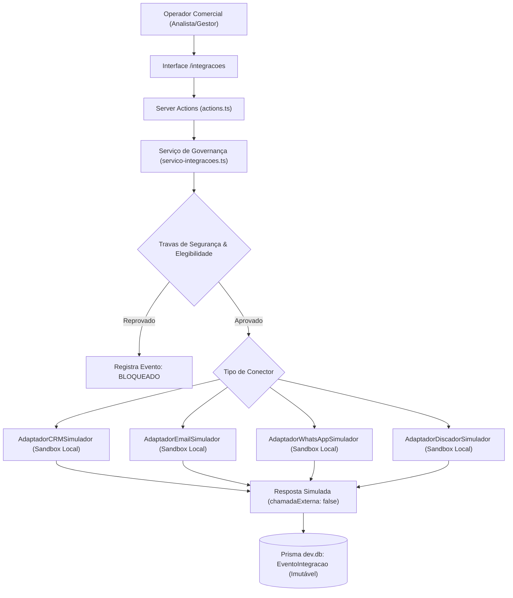

# Documentação do Gate 9 — Arquitetura de Integrações Externas

## 1. Objetivo

Estabelecer uma **camada arquitetural determinística e desacoplada de integrações externas**, isolando a lógica de negócio do domínio de qualquer fornecedor de tecnologia específico (CRM, E-mail, WhatsApp e Discador Telefônico).

O foco deste Gate é exclusivamente estrutural:
- Definição de contratos canônicos e interfaces padronizadas;
- Implementação de adaptadores com simuladores locais (sandbox);
- Controles humanos estritos e travas de segurança obrigatórias;
- Registro imutável de eventos de integração com minimização de dados e sanitização de credenciais;
- Interface operacional para governança e execução de simulações controladas em `/integracoes`.

---

## 2. Regra Absoluta e Limites Estritos de Escopo

> [!CAUTION]
> **REGRA ABSOLUTA DE INTEGRAÇÕES:**
> Nenhum dado é transmitido para servidores externos. Nenhuma mensagem é enviada. Nenhuma chamada telefônica é discada. Todos os conectores operam obrigatoriamente no modo **`SIMULACAO`**.

### 2.1. O Que NÃO Foi Implementado (Limites Absolutos)
- **CRM Externo:** Proibido. Nenhuma chamada ou conexão ativa com Salesforce, HubSpot, RD Station, Pipedrive ou outros.
- **Servidores de E-mail:** Proibido. Nenhuma chamada SMTP, IMAP, SendGrid, Resend, Amazon SES ou qualquer API externa de envio.
- **WhatsApp:** Proibido. Nenhuma integração com WhatsApp Cloud API, Evolution API, Z-API, Baileys ou webhooks remotos.
- **Discador Telefônico:** Proibido. Nenhuma conexão com troncos SIP, PABX Asterisk, Twilio, Zenvia ou discadores automáticos.
- **LinkedIn:** Proibido. Nenhum scraping autenticado, automação de mensagens ou chamadas à API da Microsoft/LinkedIn.
- **Sistemas Internos Chame:** Proibido. Nenhuma substituição de sistemas atuais sem escopo formal aprovado.
- **Receita Federal:** Proibido. O Gate da Receita Federal permanece pendente e fora de escopo.
- **Estados `ENVIADA` ou `REALIZADA`:** Terminantemente proibidos e inexistentes nos modelos e enums.

---

## 3. Arquitetura de Adaptadores Desacoplados

Localização: [`src/domain/integracoes/`](file:///C:/Users/kbadmin/Documents/Projetos/Chame%20T%C3%A1xi/chame-inteligencia/src/domain/integracoes/)

Cada conector implementa a interface genérica `AdaptadorIntegracao<TPayload>`, garantindo validação de entrada, sanitização estrita de segurança e execução simulada local com latência sintética e identificadores rastreáveis.



### 3.1. Adaptadores Implementados

| Adaptador | Arquivo | Tipo | Comportamento Sandbox |
| :--- | :--- | :--- | :--- |
| **CRM** | [`crm.ts`](file:///C:/Users/kbadmin/Documents/Projetos/Chame%20T%C3%A1xi/chame-inteligencia/src/domain/integracoes/adaptadores/crm.ts) | `CRM` | Valida estágio de oportunidade (`PROSPECCAO`, `QUALIFICACAO`, `CONTATO_INICIAL`), gera ID de oportunidade simulada (`LEAD-xxx`) e transação `SIM-CRM-xxx`. |
| **E-mail** | [`email.ts`](file:///C:/Users/kbadmin/Documents/Projetos/Chame%20T%C3%A1xi/chame-inteligencia/src/domain/integracoes/adaptadores/email.ts) | `EMAIL` | Valida e-mail corporativo publicado, assunto e corpo; gera messageId simulado (`<sim-SIM-EML-...@chame.sandbox.local>`). Sem tráfego SMTP. |
| **WhatsApp** | [`whatsapp.ts`](file:///C:/Users/kbadmin/Documents/Projetos/Chame%20T%C3%A1xi/chame-inteligencia/src/domain/integracoes/adaptadores/whatsapp.ts) | `WHATSAPP` | Valida telefone corporativo e mensagem; gera ID de mensagem sandbox (`wamid.SIM-WPP-xxx`). Ofusca número para conformidade LGPD. |
| **Discador** | [`discador.ts`](file:///C:/Users/kbadmin/Documents/Projetos/Chame%20T%C3%A1xi/chame-inteligencia/src/domain/integracoes/adaptadores/discador.ts) | `DISCADOR` | Valida campanhas de SDR e pesquisa de qualificação; gera `call-SIM-VOX-xxx` em tronco virtual `SIP-SANDBOX-LOCAL`. Sem discagem. |

---

## 4. Modelagem de Dados no Prisma

No arquivo [`prisma/schema.prisma`](file:///C:/Users/kbadmin/Documents/Projetos/Chame%20T%C3%A1xi/chame-inteligencia/prisma/schema.prisma), foram criados os seguintes enums e modelos:

### 4.1. Enums Canônicos

```prisma
enum TipoIntegracaoExterna {
  CRM
  EMAIL
  WHATSAPP
  DISCADOR
  OUTRO
}

enum AmbienteIntegracao {
  DESABILITADA
  SIMULACAO
  HOMOLOGACAO
  PRODUCAO
}

enum StatusIntegracao {
  ATIVA
  INATIVA
  ERRO_CONFIGURACAO
  PENDENTE_AUTORIZACAO
}

enum StatusEventoIntegracao {
  SIMULADO
  SUCESSO_SIMULADO
  FALHA_SIMULADA
  TIMEOUT_SIMULADO
  BLOQUEADO
  CANCELADO
}
```

### 4.2. Entidade IntegracaoExterna

Representa a configuração e metadados de um conector:

| Campo | Tipo | Descrição |
| :--- | :--- | :--- |
| `id` | `String` (cuid) | Chave primária |
| `nome` | `String` | Nome descritivo da integração |
| `tipo` | `TipoIntegracaoExterna` | `CRM`, `EMAIL`, `WHATSAPP`, `DISCADOR`, `OUTRO` |
| `ambiente` | `AmbienteIntegracao` | Padrão: **`SIMULACAO`** |
| `status` | `StatusIntegracao` | `ATIVA`, `INATIVA`, etc. |
| `configuracaoJson` | `String` | Configurações seguras e metadados (sem tokens ou senhas) |
| `descricao` | `String?` | Finalidade operacional do conector |
| `criadoEm` / `atualizadoEm` | `DateTime` | Auditoria temporal |

### 4.3. Entidade EventoIntegracao

Registro imutável de cada tentativa ou execução simulada:

| Campo | Tipo | Descrição |
| :--- | :--- | :--- |
| `id` | `String` (cuid) | Chave primária |
| `integracaoId` | `String` | Referência à integração |
| `contaComercialId` | `String?` | Conta comercial alvo |
| `contatoProfissionalId` | `String?` | Contato profissional alvo |
| `acaoComercialId` | `String?` | Ação vinculada do Gate 8 (quando houver) |
| `tipoEvento` | `String` | Identificador do evento (ex: `SIMULACAO_CRM`) |
| `status` | `StatusEventoIntegracao` | `SIMULADO`, `SUCESSO_SIMULADO`, `FALHA_SIMULADA`, `TIMEOUT_SIMULADO`, `BLOQUEADO`, `CANCELADO` |
| `payloadResumo` | `String` | JSON sanitizado do payload (sem senhas/tokens, LGPD minimizada) |
| `resultadoResumo` | `String` | JSON da resposta do simulador local |
| `erro` | `String?` | Mensagem de erro ou motivo de bloqueio |
| `usuarioSolicitante` | `String` | Identificação do operador responsável |
| `justificativa` | `String` | Justificativa formal registrada |
| `criadoEm` | `DateTime` | Timestamp imutável da operação |

---

## 5. Travas de Segurança e Governança Humana

Todas as solicitações passam obrigatoriamente pelo validador central em [`src/domain/integracoes/servico-integracoes.ts`](file:///C:/Users/kbadmin/Documents/Projetos/Chame%20T%C3%A1xi/chame-inteligencia/src/domain/integracoes/servico-integracoes.ts):

1. **Bloqueio de Integrações Inativas ou Desabilitadas:** Bloqueio imediato caso a integração não esteja com status `ATIVA`.
2. **Trava de Ambiente Obrigatório:** Qualquer tentativa de acionamento com ambiente diferente de `SIMULACAO` é terminantemente bloqueada com aviso de infração de governança.
3. **Validação da Conta Comercial:** A conta deve existir, estar ativa e possuir agrupamento econômico e instituição de saúde válidos.
4. **Validação Estrita de Contatos (Gate 7):**
   - O contato deve possuir status de decisão **`APROVADO`** e `ativo: true`.
   - Contatos em status `PENDENTE`, `REJEITADO` ou inativos são sumariamente bloqueados.
   - Presença obrigatória de canal corporativo válido correspondente ao tipo de integração.
5. **Isolamento Canônico Absoluto:**
   - Contas `DEMONSTRACAO` só podem ser vinculadas a contatos `DEMONSTRACAO`.
   - Contas reais `FATO_OFICIAL` só podem ser vinculadas a contatos `FATO_PUBLICO`.
   - Tentativas de cruzamento de dados geram bloqueio imediato por violação de integridade.
6. **Validação de Ações Planejadas (Gate 8):** Ações comerciais vinculadas devem estar com status **`APROVADA_PARA_SIMULACAO`** ou **`SIMULADA`**. Ações em `RASCUNHO`, `AGUARDANDO_REVISAO`, `CANCELADA` ou `BLOQUEADA` são rejeitadas.
7. **Compliance LGPD e Minimização de Dados:**
   - Finalidade comercial registrada obrigatória.
   - Justificativa do operador e identificação do usuário obrigatórias.
   - Sanitização de payload com eliminação de credenciais, tokens, senhas e ofuscação de telefones.
8. **Limite Rígido para Lotes:** Máximo de 10 simulações por lote (`LIMITE_MAXIMO_LOTE_SIMULACAO = 10`). Lotes excedentes são terminantemente rejeitados antes da execução.
9. **Confirmação Humana Prévia Obrigatória:** A execução no simulador só é permitida após visualização da prévia do payload sanitizado e clique explícito de confirmação pelo operador.

---

## 6. Interface de Governança (`/integracoes`)

A rota [`/integracoes`](file:///C:/Users/kbadmin/Documents/Projetos/Chame%20T%C3%A1xi/chame-inteligencia/src/app/integracoes/page.tsx) foi disponibilizada com link direto na barra lateral de navegação:

- **Banner Permanente de Alerta:** Destaque visual avisando que o ambiente opera exclusivamente em simulação controlada sem conexões externas.
- **Painel de KPIs:** Indicadores em tempo real de conectores ativos, total de simulações, sucessos simulados, falhas simuladas, bloqueios de segurança e cancelamentos/timeouts.
- **Tabela de Conectores Cadastrados:** Exibição dos 4 conectores padrão com selos de ambiente `SIMULAÇÃO CONTROLADA`, status e botão para acionar simulação individual.
- **Histórico e Trilha de Auditoria:** Tabela detalhada de eventos com filtros combinados por tipo de integração, status do evento e busca textual em tempo real.
- **Modal de Simulação Individual em 3 Etapas:**
  1. *Configuração:* Seleção de conector, conta, contato aprovado, ação vinculada, justificativa, finalidade e cenário de teste (Normal, Falha, Timeout, Cancelamento).
  2. *Prévia e Confirmação:* Exibição de conformidade de elegibilidade e visualizador de JSON sanitizado.
  3. *Resultado Sandbox:* Exibição do ID da transação simulada, tempo de resposta sintético e detalhes da simulação.
- **Modal de Auditoria de Evento:** Visualizador completo com formatação JSON de payload sanitizado e resposta simulada armazenados no banco.

---

## 7. Suíte de Testes Automatizados

A suíte em [`src/domain/integracoes/integracoes.test.ts`](file:///C:/Users/kbadmin/Documents/Projetos/Chame%20T%C3%A1xi/chame-inteligencia/src/domain/integracoes/integracoes.test.ts) foi executada com sucesso total:

| Item | Cenário Testado | Resultado |
| :---: | :--- | :---: |
| **1** | Bloqueio absoluto quando integração estiver inativa ou desabilitada | **PASSOU** |
| **2** | Ambiente `SIMULACAO` padrão e bloqueio de tentativas de produção | **PASSOU** |
| **3** | Ausência total de chamadas de rede externas (`chamadaExternaRealizada: false`) | **PASSOU** |
| **4** | Bloqueio de contatos não aprovados, inativos ou rejeitados (Gate 7) | **PASSOU** |
| **5** | Bloqueio de ações comerciais não aprovadas (Gate 8) | **PASSOU** |
| **6** | Bloqueio quando ausente confirmação humana ou justificativa obrigatória | **PASSOU** |
| **7** | Sanitização de payload sem persistir senhas, tokens ou dados pessoais excessivos | **PASSOU** |
| **8** | Resposta simulada padronizada para CRM, E-mail, WhatsApp e Discador | **PASSOU** |
| **9** | Registro imutável de `EventoIntegracao` para auditoria | **PASSOU** |
| **10** | Tratamento de falha simulada, timeout simulado e cancelamento prévio | **PASSOU** |
| **11** | Garantia de inexistência de status `ENVIADA` ou `REALIZADA` | **PASSOU** |
| **12** | Isolamento estrito entre dados `DEMONSTRACAO` e `FATO_OFICIAL`/`FATO_PUBLICO` | **PASSOU** |
| **13** | Bloqueio de execuções em lote que excedam o limite máximo de 10 itens | **PASSOU** |

---

## 8. Auditoria do Banco de Dados Canônico

Verificação direta no Prisma após o fechamento do Gate 9:

- **Instituições Reais (`FATO_OFICIAL`):** 8.212
- **Instituições Demonstração (`DEMONSTRACAO`):** 5
- **Agrupamentos Econômicos:** 7.550
- **Contas Comerciais:** 7.555
- **Contatos Profissionais Públicos:** 123 (109 reais `FATO_PUBLICO`, 14 demonstração `DEMONSTRACAO`)
- **Contatos sem fonte:** 0
- **Ações Comerciais em Banco:** 0
- **Ações com status `ENVIADA` ou `REALIZADA`:** 0
- **Integrações Externas Registradas:** 4 (todas em modo `SIMULACAO`)
- **Vulnerabilidades de dependências (`npm audit`):** 0

---

## 9. Declaração Formal de Status

Com a implementação da camada de adaptadores desacoplada, os simuladores locais para CRM, E-mail, WhatsApp e Discador, os modelos `IntegracaoExterna` e `EventoIntegracao`, as travas de governança humana, a interface `/integracoes` e todos os testes automatizados verdes sem chamadas externas:

**Status Declarado:** `GATE 9 — APROVADO`
